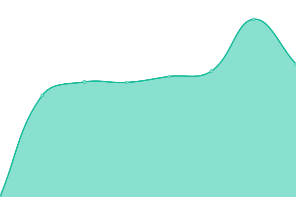
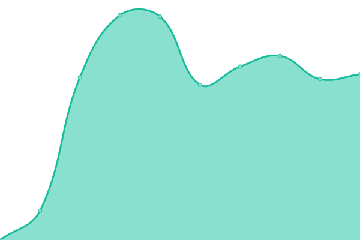

# [📈 Live Status](https://demo.upptime.js.org): <!--live status--> **🟧 Partial outage**

This repository contains the open-source uptime monitor and status page for [Ward Beyens](https://wardbeyens.be/), powered by [Upptime](https://github.com/upptime/upptime).

With [Upptime](https://upptime.js.org), you can get your own unlimited and free uptime monitor and status page, powered entirely by a GitHub repository. We use [Issues](https://github.com/wardbeyens/monitor/issues) as incident reports, [Actions](https://github.com/wardbeyens/monitor/actions) as uptime monitors, and [Pages](https://demo.upptime.js.org) for the status page.

<!--start: status pages-->
<!-- This summary is generated by Upptime (https://github.com/upptime/upptime) -->
<!-- Do not edit this manually, your changes will be overwritten -->
<!-- prettier-ignore -->
| URL | Status | History | Response Time | Uptime |
| --- | ------ | ------- | ------------- | ------ |
|  [Wardbeyens](https://wardbeyens.be) | 🟥 Down | [wardbeyens.yml](https://github.com/wardbeyens/monitor/commits/HEAD/history/wardbeyens.yml) | 

 1609ms
     
 | 

<a href="https://wardbeyens.github.io/monitor/history/wardbeyens">98.17%</a>
    

|  [Wabyte](https://wabyte.com) | 🟥 Down | [wabyte.yml](https://github.com/wardbeyens/monitor/commits/HEAD/history/wabyte.yml) | 

 0ms
     
 | 

<a href="https://wardbeyens.github.io/monitor/history/wabyte">0.00%</a>
    

|  [Grafi](https://grafi.ml) | 🟥 Down | [grafi.yml](https://github.com/wardbeyens/monitor/commits/HEAD/history/grafi.yml) | 

 931ms
     
 | 

<a href="https://wardbeyens.github.io/monitor/history/grafi">98.18%</a>
    

|  [Requests](https://requests.grafi.ml/) | 🟥 Down | [requests.yml](https://github.com/wardbeyens/monitor/commits/HEAD/history/requests.yml) | 

 1208ms
     
 | 

<a href="https://wardbeyens.github.io/monitor/history/requests">98.18%</a>
    

|  [Wardflix](https://wardflix.ga/) | 🟥 Down | [wardflix.yml](https://github.com/wardbeyens/monitor/commits/HEAD/history/wardflix.yml) | 

 903ms
     
 | 

<a href="https://wardbeyens.github.io/monitor/history/wardflix">98.19%</a>
    

|  [Code server](https://code.wabyte.com/) | 🟥 Down | [code-server.yml](https://github.com/wardbeyens/monitor/commits/HEAD/history/code-server.yml) | 

 618ms
     
 | 

<a href="https://wardbeyens.github.io/monitor/history/code-server">98.19%</a>
    

|  [Trainconnections](https://trainconnections.slowby.ga/) | 🟩 Up | [trainconnections.yml](https://github.com/wardbeyens/monitor/commits/HEAD/history/trainconnections.yml) | 

 821ms
     
 | 

<a href="https://wardbeyens.github.io/monitor/history/trainconnections">98.20%</a>
    

|  [Trainconnections API](https://api.trainconnections.slowby.ga/health) | 🟩 Up | [trainconnections-api.yml](https://github.com/wardbeyens/monitor/commits/HEAD/history/trainconnections-api.yml) | 

 835ms
     
 | 

<a href="https://wardbeyens.github.io/monitor/history/trainconnections-api">98.21%</a>
    

|  [Slowby.travel](https://www.slowby.travel) | 🟩 Up | [slowby-travel.yml](https://github.com/wardbeyens/monitor/commits/HEAD/history/slowby-travel.yml) | 

 352ms
     
 | 

<a href="https://wardbeyens.github.io/monitor/history/slowby-travel">100.00%</a>
    

|  [Lotte en Ward](https://lotte.en.wardbeyens.be) | 🟩 Up | [lotte-en-ward.yml](https://github.com/wardbeyens/monitor/commits/HEAD/history/lotte-en-ward.yml) | 

 697ms
     
 | 

<a href="https://wardbeyens.github.io/monitor/history/lotte-en-ward">98.21%</a>
    

|  [Docus](https://docus.wardbeyens.be) | 🟩 Up | [docus.yml](https://github.com/wardbeyens/monitor/commits/HEAD/history/docus.yml) | 

 440ms
     
 | 

<a href="https://wardbeyens.github.io/monitor/history/docus">98.22%</a>
    

|  [Cloud](https://cloud.wardbeyens.be) | 🟩 Up | [cloud.yml](https://github.com/wardbeyens/monitor/commits/HEAD/history/cloud.yml) | 

 1779ms
     
 | 

<a href="https://wardbeyens.github.io/monitor/history/cloud">98.22%</a>
    

|  [Face Detection](https://face-detection.wabyte.com) | 🟩 Up | [face-detection.yml](https://github.com/wardbeyens/monitor/commits/HEAD/history/face-detection.yml) | 

 491ms
     
 | 

<a href="https://wardbeyens.github.io/monitor/history/face-detection">98.23%</a>
    

|  [Notifications](https://notifications.wabyte.com) | 🟩 Up | [notifications.yml](https://github.com/wardbeyens/monitor/commits/HEAD/history/notifications.yml) | 

 466ms
     
 | 

<a href="https://wardbeyens.github.io/monitor/history/notifications">98.23%</a>
    

<!--end: status pages-->

[**Visit our status website →**](https://demo.upptime.js.org)

## 📄 License

- Powered by: [Upptime](https://github.com/upptime/upptime)
- Code: [MIT](./LICENSE) © [Ward Beyens](https://wardbeyens.be/)
- Data in the `./history` directory: [Open Database License](https://opendatacommons.org/licenses/odbl/1-0/)
