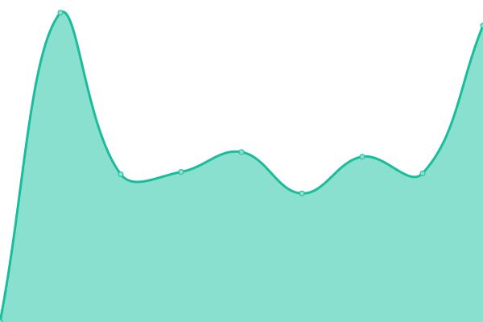

# [📈 Live Status](https://demo.upptime.js.org): <!--live status--> **🟧 Partial outage**

This repository contains the open-source uptime monitor and status page for [Ward Beyens](https://wardbeyens.be/), powered by [Upptime](https://github.com/upptime/upptime).

With [Upptime](https://upptime.js.org), you can get your own unlimited and free uptime monitor and status page, powered entirely by a GitHub repository. We use [Issues](https://github.com/wardbeyens/monitor/issues) as incident reports, [Actions](https://github.com/wardbeyens/monitor/actions) as uptime monitors, and [Pages](https://demo.upptime.js.org) for the status page.

<!--start: status pages-->
<!-- This summary is generated by Upptime (https://github.com/upptime/upptime) -->
<!-- Do not edit this manually, your changes will be overwritten -->
<!-- prettier-ignore -->
| URL | Status | History | Response Time | Uptime |
| --- | ------ | ------- | ------------- | ------ |
|  [Wardbeyens](https://wardbeyens.be) | 🟩 Up | [wardbeyens.yml](https://github.com/wardbeyens/monitor/commits/HEAD/history/wardbeyens.yml) | 

 833ms
     
 | 

<a href="https://wardbeyens.github.io/monitor/history/wardbeyens">100.00%</a>
    

|  [Wabyte](https://wabyte.com) | 🟥 Down | [wabyte.yml](https://github.com/wardbeyens/monitor/commits/HEAD/history/wabyte.yml) | 

 0ms
     
 | 

<a href="https://wardbeyens.github.io/monitor/history/wabyte">8.68%</a>
    

|  [Grafi](https://grafi.ml) | 🟩 Up | [grafi.yml](https://github.com/wardbeyens/monitor/commits/HEAD/history/grafi.yml) | 

 916ms
     
 | 

<a href="https://wardbeyens.github.io/monitor/history/grafi">100.00%</a>
    

|  [Requests](https://requests.grafi.ml/) | 🟩 Up | [requests.yml](https://github.com/wardbeyens/monitor/commits/HEAD/history/requests.yml) | 

 714ms
     
 | 

<a href="https://wardbeyens.github.io/monitor/history/requests">100.00%</a>
    

<!--end: status pages-->

[**Visit our status website →**](https://demo.upptime.js.org)

## 📄 License

- Powered by: [Upptime](https://github.com/upptime/upptime)
- Code: [MIT](./LICENSE) © [Ward Beyens](https://wardbeyens.be/)
- Data in the `./history` directory: [Open Database License](https://opendatacommons.org/licenses/odbl/1-0/)
